# Домашнее задание: «Оркестрация группой Docker контейнеров на примере Docker Compose»

Выполнено на локальной Ubuntu-ВМ (VirtualBox).

---

## Задача 1. Docker, Docker Compose, кастомный образ nginx

### Установка Docker и Docker Compose plugin

Docker установлен по официальной инструкции (репозиторий `download.docker.com` для Ubuntu):

```bash
sudo apt-get update
sudo apt-get install -y ca-certificates curl gnupg
sudo install -m 0755 -d /etc/apt/keyrings
curl -fsSL https://download.docker.com/linux/ubuntu/gpg | sudo gpg --dearmor -o /etc/apt/keyrings/docker.gpg
sudo chmod a+r /etc/apt/keyrings/docker.gpg

echo \
  "deb [arch=$(dpkg --print-architecture) signed-by=/etc/apt/keyrings/docker.gpg] https://download.docker.com/linux/ubuntu \
  $(. /etc/os-release && echo "$VERSION_CODENAME") stable" | \
  sudo tee /etc/apt/sources.list.d/docker.list > /dev/null

sudo apt-get update
sudo apt-get install -y docker-ce docker-ce-cli containerd.io docker-buildx-plugin docker-compose-plugin
sudo usermod -aG docker $USER
```

**Проверка версий и работоспособности:**

```bash
$ docker --version
Docker version 28.1.1, build 4eba377

$ docker compose version
Docker Compose version v2.35.1

$ docker run hello-world
Hello from Docker!
This message shows that your installation appears to be working correctly.
```

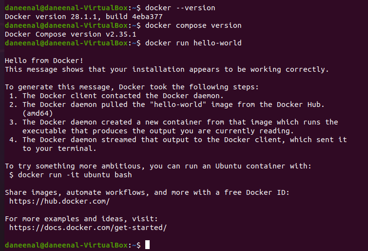

DockerHub доступен напрямую, настройка `registry-mirrors` в `/etc/docker/daemon.json` не потребовалась.

### Скачивание базового образа nginx:1.29.0

```bash
$ docker pull nginx:1.29.0
1.29.0: Pulling from library/nginx
...
Digest: sha256:3ab4ed065a1437cbbd45e65617b1285bdf6523c6bf56a121e00df41720e09a89
Status: Downloaded newer image for nginx:1.29.0
```

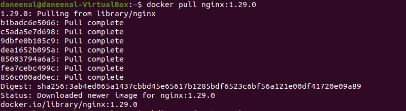

### Dockerfile

```dockerfile
FROM nginx:1.29.0
COPY index.html /usr/share/nginx/html/index.html
```

### index.html

```html
<html>
<head>
Hey, Netology
</head>
<body>
<h1>I will be DevOps Engineer!</h1>
</body>
</html>
```

### Сборка образа

```bash
$ docker build -t daneenal/custom-nginx:1.0.0 .
[+] Building 0.3s (7/7) FINISHED
 => [internal] load build definition from Dockerfile
 => [1/2] FROM docker.io/library/nginx:1.29.0
 => [2/2] COPY index.html /usr/share/nginx/html/index.html
 => naming to docker.io/daneenal/custom-nginx:1.0.0
```

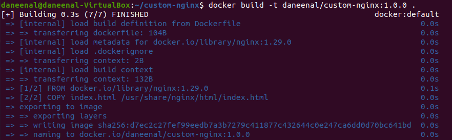

### Отправка образа в Docker Hub

```bash
$ docker push daneenal/custom-nginx:1.0.0
The push refers to repository [docker.io/daneenal/custom-nginx]
...
1.0.0: digest: sha256:65fc57e1cc4844bf67c44ef012b47c4843ff4830a7db4f31287972e56f1ada0e size: 1985
```

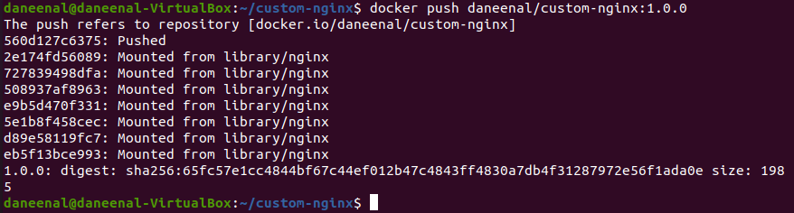

### Ссылка на репозиторий в Docker Hub

🔗 https://hub.docker.com/repository/docker/daneenal/custom-nginx/general

---

## Задача 2. Запуск контейнера, проверка

### Запуск контейнера с требуемыми параметрами

```bash
$ docker run -d \
    --name Kuzminykh-Daniil-Andreevich-custom-nginx-t2 \
    -p 127.0.0.1:8080:80 \
    daneenal/custom-nginx:1.0.0
827f7fe0328ec29cb9cb02ea9edd76bb5ed23ca50c74a80e0b4caf95158a2211
```

### Переименование контейнера (без удаления)

```bash
$ docker rename Kuzminykh-Daniil-Andreevich-custom-nginx-t2 custom-nginx-t2
```

### Проверочная команда

```bash
$ date +"%d-%m-%Y %T.%N %Z" ; sleep 0.150 ; docker ps ; ss -tlpn | grep 127.0.0.1:8080 ; docker logs custom-nginx-t2 -n1 ; docker exec -it custom-nginx-t2 base64 /usr/share/nginx/html/index.html

25-09-2026 23:29:38.314733987 +05

CONTAINER ID   IMAGE                        COMMAND                  STATUS          PORTS                      NAMES
827f7fe0328e   daneenal/custom-nginx:1.0.0  "/docker-entrypoint.…"   Up About a minute   127.0.0.1:8080->80/tcp   custom-nginx-t2

LISTEN  0  4096  127.0.0.1:8080  0.0.0.0:*

2026/09/25 18:28:38 [notice] 1#1: start worker process 30

PGh0bWw+CjxoZWFkPgpIZXksIE5ldG9sb2d5CjwvaGVhZD4KPGJvZHk+CjxoMT5JIHdpbGwgYmUgRGV2T3BzIEVuZ2luZWVyITwvaDE+CjwvYm9keT4KPC9odG1sPgo=
```

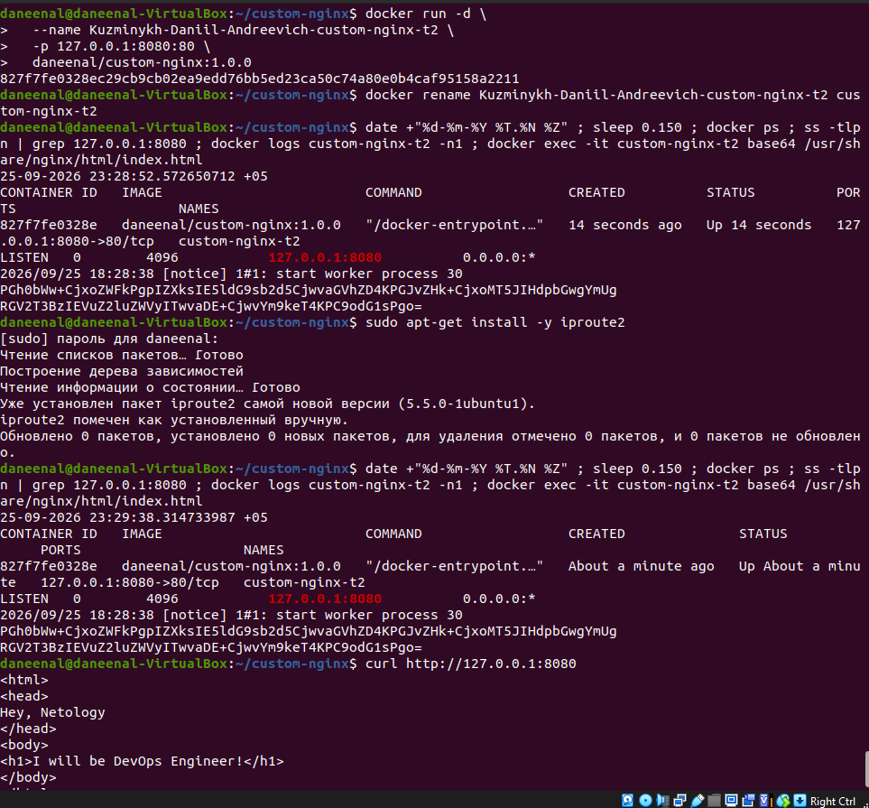

### Проверка через curl

```bash
$ curl http://127.0.0.1:8080
<html>
<head>
Hey, Netology
</head>
<body>
<h1>I will be DevOps Engineer!</h1>
</body>
</html>
```

Страница доступна, содержимое соответствует заданию.

---

## Задача 3. stdin/stdout/stderr, редактирование конфига, удаление контейнера

### Подключение к контейнеру и остановка через Ctrl+C

```bash
$ docker attach custom-nginx-t2
^C2026/09/25 18:32:11 [notice] 1#1: signal 2 (SIGINT) received, exiting
2026/09/25 18:32:11 [notice] 29#29: exiting
2026/09/25 18:32:11 [notice] 29#29: exit
2026/09/25 18:32:11 [notice] 30#30: exiting
2026/09/25 18:32:11 [notice] 30#30: exit
2026/09/25 18:32:11 [notice] 1#1: signal 17 (SIGCHLD) received from 29
2026/09/25 18:32:11 [notice] 1#1: worker process 29 exited with code 0
2026/09/25 18:32:11 [notice] 1#1: signal 29 (SIGIO) received
2026/09/25 18:32:11 [notice] 1#1: signal 17 (SIGCHLD) received from 30
2026/09/25 18:32:11 [notice] 1#1: worker process 30 exited with code 0
2026/09/25 18:32:11 [notice] 1#1: exit

$ docker ps -a
CONTAINER ID   IMAGE                        STATUS
827f7fe0328e   daneenal/custom-nginx:1.0.0  Exited (0) 40 seconds ago   custom-nginx-t2
```

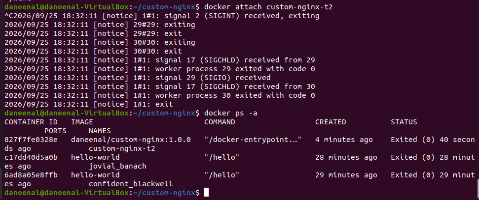

**Почему контейнер остановился:**

Команда `docker attach` подключает терминал напрямую к **главному процессу контейнера** (PID 1) — в данном случае это master-процесс nginx. В отличие от `docker exec`, где команда выполняется в *отдельном* дополнительном процессе внутри уже работающего контейнера, `attach` работает именно с тем процессом, который поддерживает жизнь контейнера.

Когда была нажата комбинация **Ctrl-C**, терминал отправил сигнал **SIGINT** этому главному процессу. Nginx получил сигнал, корректно завершил все свои worker-процессы (видно в логе — "signal 2 (SIGINT) received, exiting") и штатно закрылся сам. Как только процесс с PID 1 завершается — Docker считает жизненный цикл контейнера оконченным и переводит его в статус `Exited`, даже если сам процесс завершился «чисто» (код выхода 0), а не аварийно.

Иными словами, в контейнерах нет отдельного «init»-процесса, который пережил бы завершение главного приложения — если завершается PID 1, завершается и весь контейнер.

### Перезапуск контейнера, вход в bash, установка редактора

```bash
$ docker start custom-nginx-t2
custom-nginx-t2

$ docker exec -it custom-nginx-t2 bash
root@827f7fe0328e:/#

$ apt-get update
$ apt-get install -y nano
...
Setting up nano (7.2-1+deb12u1) ...
```

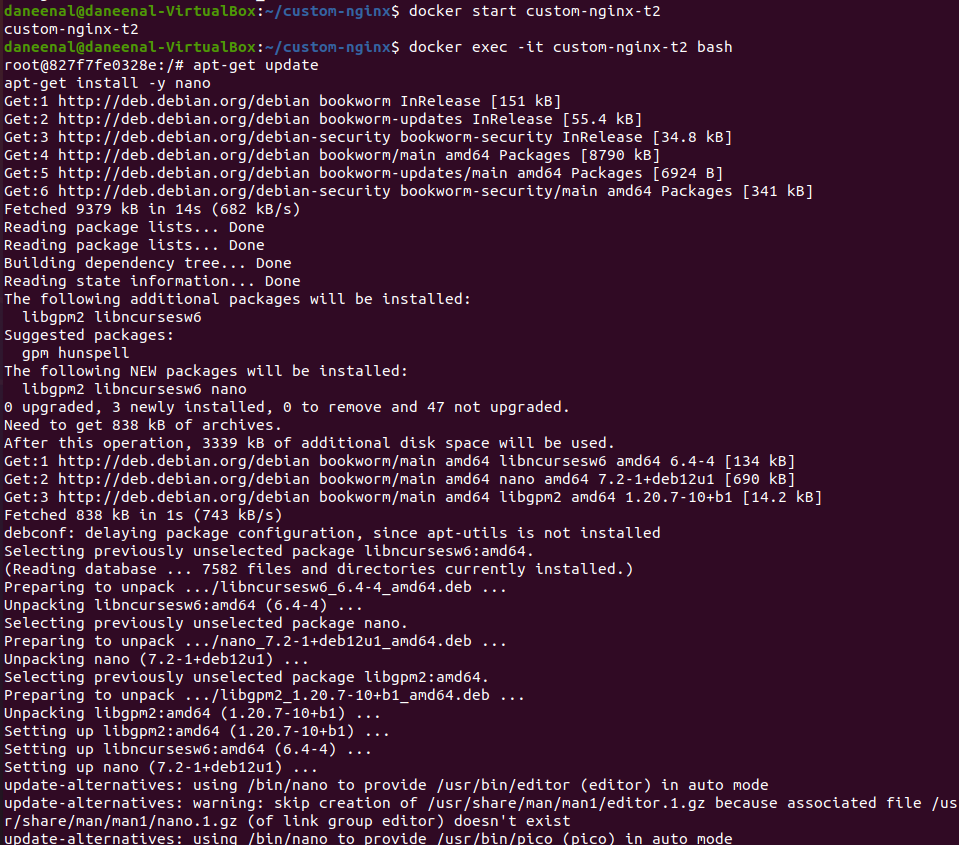
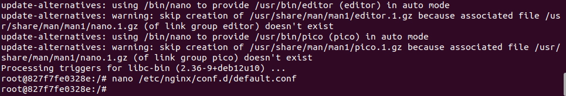

### Редактирование конфигурации и проверка портов внутри/снаружи контейнера

Строка `listen 80;` в `/etc/nginx/conf.d/default.conf` заменена на `listen 81;`.

```bash
root@827f7fe0328e:/# nginx -s reload
2026/09/25 18:36:16 [notice] 175#175: signal process started

root@827f7fe0328e:/# curl http://127.0.0.1:80
curl: (7) Failed to connect to 127.0.0.1 port 80 after 0 ms: Couldn't connect to server

root@827f7fe0328e:/# curl http://127.0.0.1:81
<html>
<head>
Hey, Netology
</head>
<body>
<h1>I will be DevOps Engineer!</h1>
</body>
</html>

root@827f7fe0328e:/# exit

$ ss -tlpn | grep 127.0.0.1:8080
LISTEN  0  4096  127.0.0.1:8080  0.0.0.0:*

$ docker port custom-nginx-t2
80/tcp -> 127.0.0.1:8080

$ curl http://127.0.0.1:8080
curl: (56) Recv failure: Соединение разорвано другой стороной
```

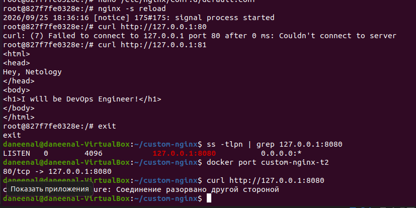

**Объяснение возникшей проблемы:**

Проброс портов в Docker (`-p 127.0.0.1:8080:80`) настраивается **на уровне сети контейнера при его запуске** и работает как статическое правило: «всё, что приходит на 8080 хоста, отправляется на порт 80 внутри контейнера». Команды `ss -tlpn` и `docker port` подтверждают, что это правило проброса не изменилось и по-прежнему указывает на порт 80 контейнера.

Однако сам nginx **внутри** контейнера после правки конфигурации и `nginx -s reload` перестал слушать порт 80 и переключился на порт 81. Docker ничего не знает о том, что происходит внутри процесса контейнера, — он лишь механически пересылает трафик на порт 80, как было указано при запуске. Поскольку на порту 80 внутри контейнера теперь никто не слушает, соединение с хоста обрывается: `curl` на `127.0.0.1:8080` получает ошибку `Recv failure: Соединение разорвано другой стороной`.

Иными словами, проброс портов Docker не привязан динамически к тому, что реально слушает процесс внутри контейнера, — это статическая настройка, заданная один раз при `docker run`, и она не отслеживает изменения конфигурации приложения после старта.

*Дополнительное (необязательное) задание по самостоятельному исправлению конфигурации без изменения nginx и без удаления контейнера — пропущено.*

### Удаление запущенного контейнера без предварительной остановки

```bash
$ docker ps -a
827f7fe0328e   daneenal/custom-nginx:1.0.0   Exited (0) 6 minutes ago    custom-nginx-t2

$ docker start custom-nginx-t2
custom-nginx-t2

$ docker ps
827f7fe0328e   daneenal/custom-nginx:1.0.0   Up 1 second   127.0.0.1:8080->80/tcp   custom-nginx-t2

$ docker rm -f custom-nginx-t2
custom-nginx-t2

$ docker ps -a
c17dd40d5a0b   hello-world   Exited (0) 42 minutes ago   jovial_banach
6ad8a05e8ffb   hello-world   Exited (0) 42 minutes ago   confident_blackwell
```

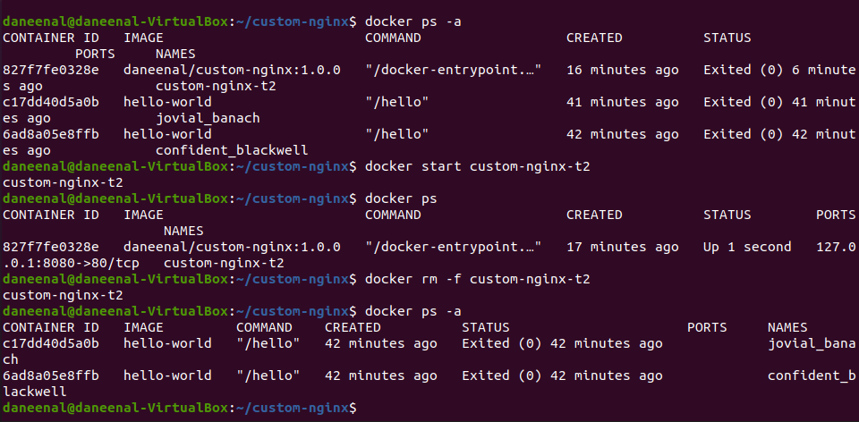

Контейнер `custom-nginx-t2` успешно удалён флагом `-f` (force) без отдельной команды `docker stop` — Docker сам останавливает контейнер перед удалением при использовании этого флага.

---

## Задача 4. Volumes между контейнерами

### Запуск первого контейнера (centos)

Официальный тег `centos:latest` удалён из Docker Hub (CentOS Linux официально снят с поддержки), поэтому использован тег `centos:7`.

```bash
$ docker run -d --name centos-vol -v $(pwd):/data centos:7 sleep infinity
Unable to find image 'centos:7' locally
7: Pulling from library/centos
...
Status: Downloaded newer image for centos:7
8029bfedea2784024936389c3a00607c3abd43f5a3fec12dae13e15394e66e94

$ docker ps
CONTAINER ID   IMAGE      COMMAND            STATUS          NAMES
8029bfedea27   centos:7   "sleep infinity"   Up 3 seconds    centos-vol
```

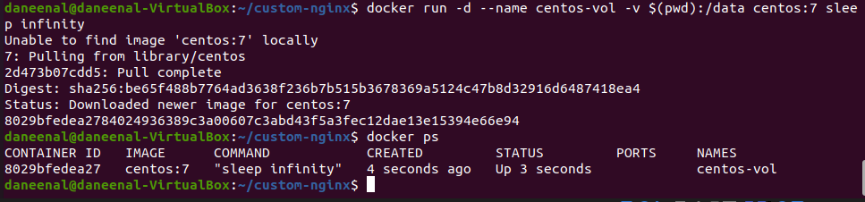

### Запуск второго контейнера (debian)

```bash
$ docker run -d --name debian-vol -v $(pwd):/data debian sleep infinity
Unable to find image 'debian:latest' locally
latest: Pulling from library/debian
...
Status: Downloaded newer image for debian:latest
78053e9880ebc7d97219e1631e635a8510ada7f3e1fb59ef3c8b325fedde304c

$ docker ps
CONTAINER ID   IMAGE      COMMAND            STATUS         NAMES
78053e9880eb   debian     "sleep infinity"   Up 5 seconds   debian-vol
8029bfedea27   centos:7   "sleep infinity"   Up 56 seconds  centos-vol
```

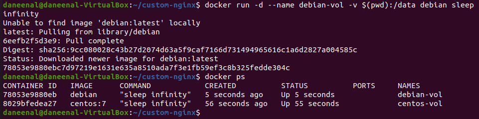

### Создание файлов и проверка общего доступа

```bash
$ docker exec -it centos-vol bash -c "echo 'Файл создан из centos-vol' > /data/from_centos.txt"
$ docker exec -it centos-vol cat /data/from_centos.txt
Файл создан из centos-vol

$ echo "Файл создан с хоста" > $(pwd)/from_host.txt

$ docker exec -it debian-vol ls -la /data
total 28
drwxrwxr-x 2 1000  996 4096 Sep 25 18:49  .
drwxr-xr-x 1 root root 4096 Sep 25 18:48  ..
-rw-rw-r-- 1 1000  996   67 Sep 25 18:22  Dockerfile
-rw-r--r-- 1 root root   38 Sep 25 18:49  from_centos.txt
-rw-r--r-- 1 root root   36 Sep 25 18:49  from_host.txt
-rw-rw-r-- 1 1000  996   95 Sep 25 18:22  index.html

$ docker exec -it debian-vol bash -c "cat /data/from_centos.txt; echo '---'; cat /data/from_host.txt"
Файл создан из centos-vol
---
Файл создан с хоста
```

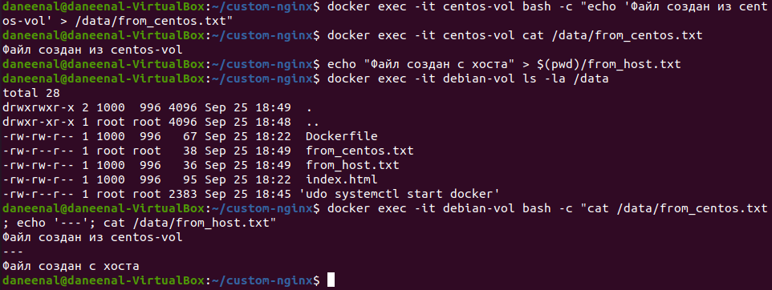

**Вывод:** оба контейнера смонтировали один и тот же каталог хоста (`$(pwd)`) в `/data` через ключ `-v`. Файлы, созданные в одном контейнере или на хосте, мгновенно становятся видны во всех остальных местах — это подтверждает, что данные не копируются, а физически являются одним и тем же каталогом на диске хоста, просто «показанным» внутри каждого контейнера по разным путям.

---

## Задача 5. Docker Compose + локальный Registry + Portainer

### Подготовка двух compose-файлов

`compose.yaml`:
```yaml
version: "3"
services:
  portainer:
    network_mode: host
    image: portainer/portainer-ce:latest
    volumes:
      - /var/run/docker.sock:/var/run/docker.sock
```

`docker-compose.yaml`:
```yaml
version: "3"
services:
  registry:
    image: registry:2
    ports:
      - "5000:5000"
```

### Запуск docker compose up -d при двух файлах

```bash
$ docker compose up -d
WARN[0000] Found multiple config files with supported names: /tmp/netology/docker/task5/compose.yaml, /tmp/netology/docker/task5/docker-compose.yaml
WARN[0000] Using /tmp/netology/docker/task5/compose.yaml
WARN[0000] the attribute `version` is obsolete, it will be ignored, please remove it to avoid potential confusion
[+] Running 8/8
 ✔ portainer Pulled
[+] Running 1/1
 ✔ Container task5-portainer-1  Started

$ docker ps
f492093917c9   portainer/portainer-ce:latest  "/portainer"    Up 18 seconds   task5-portainer-1
```

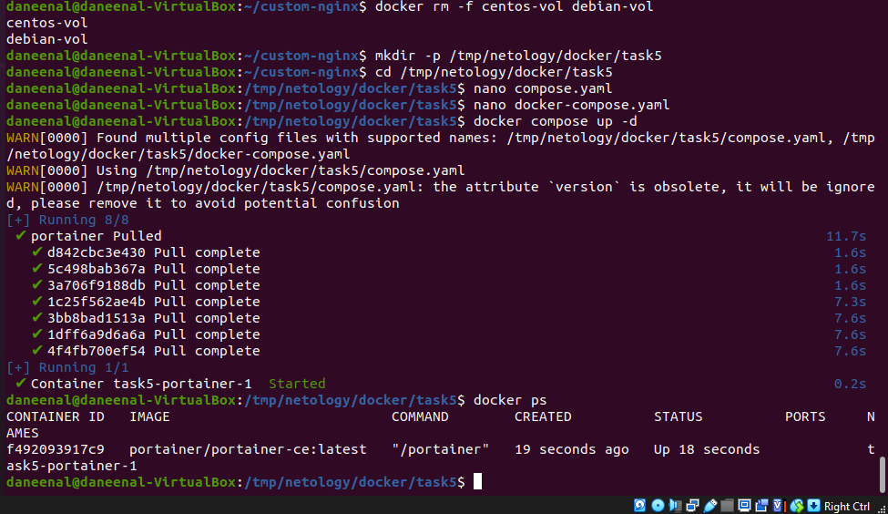

**Какой файл был запущен и почему:**

Был запущен только **`compose.yaml`** (сервис `portainer`) — `docker-compose.yaml` (с сервисом `registry`) проигнорирован. Причина видна прямо в предупреждении: *«Found multiple config files with supported names... Using /tmp/netology/docker/task5/compose.yaml»*.

Согласно Compose file model, при наличии в одной директории сразу нескольких файлов с поддерживаемыми именами (`compose.yaml`, `compose.yml`, `docker-compose.yaml`, `docker-compose.yml`), Compose **не объединяет** их автоматически — вместо этого выбирается **только один** файл по приоритету, и `compose.yaml` имеет более высокий приоритет, чем `docker-compose.yaml` (последний оставлен для обратной совместимости со старыми версиями инструмента). Поэтому был поднят только `portainer`, а `registry` остался незапущенным.

### Правка compose.yaml через include, чтобы запускались оба файла

```yaml
include:
  - docker-compose.yaml

services:
  portainer:
    network_mode: host
    image: portainer/portainer-ce:latest
    volumes:
      - /var/run/docker.sock:/var/run/docker.sock
```

```bash
$ docker compose down
$ docker compose up -d
[+] Running 6/6
 ✔ registry Pulled
[+] Running 3/3
 ✔ Network task5_default        Created
 ✔ Container task5-registry-1   Started
 ✔ Container task5-portainer-1  Started

$ docker ps
CONTAINER ID   IMAGE                          STATUS         PORTS                                          NAMES
9f17d79e63cb   registry:2                     Up 4 seconds   0.0.0.0:5000->5000/tcp, [::]:5000->5000/tcp   task5-registry-1
ce38bd745018   portainer/portainer-ce:latest  Up 4 seconds                                                  task5-portainer-1
```

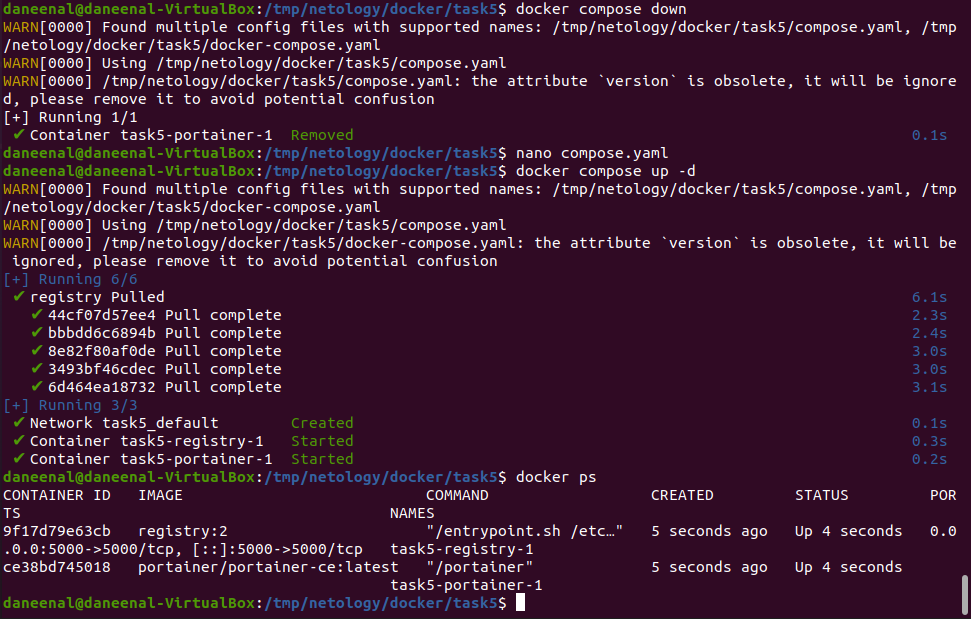

Оба сервиса — `portainer` и `registry` — теперь успешно запущены одновременно благодаря директиве `include`, которая явно подключает содержимое второго compose-файла к первому.

### Заливка образа custom-nginx в локальный registry

```bash
$ docker tag daneenal/custom-nginx:1.0.0 127.0.0.1:5000/custom-nginx:latest

$ docker push 127.0.0.1:5000/custom-nginx:latest
The push refers to repository [127.0.0.1:5000/custom-nginx]
...
latest: digest: sha256:de31768f738b28544c94949839a50bc78c223919eab0741e0076a0102abf0611 size: 1985

$ curl http://127.0.0.1:5000/v2/_catalog
{"repositories":["custom-nginx"]}
```

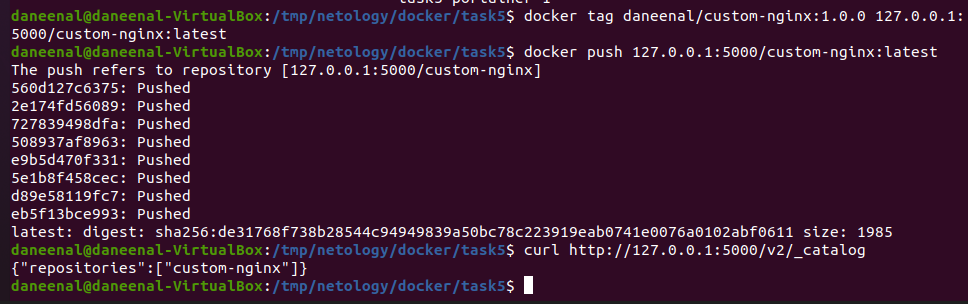

Образ успешно загружен в локальный Docker Registry, что подтверждено ответом API каталога registry.

### Первоначальная настройка Portainer

Portainer открыт по адресу `http://127.0.0.1:9000` (сработал `network_mode: host`). При создании администратора возник таймаут первичной настройки (5 минут с момента старта контейнера) — потребовалось получить setup token из логов и повторить настройку после `docker restart`:

```bash
$ docker logs task5-portainer-1 2>&1 | grep -i token
...
setup_token=7db4831943dc0c4a47f653b1a1708662aa180b02b41724746c2c46344c9401ec
```

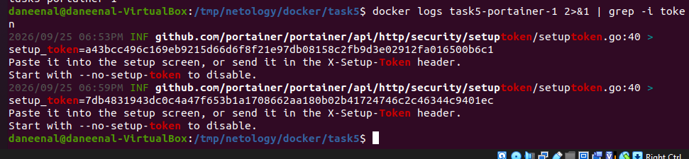

Администратор создан успешно (username: `admin`, пароль 12+ символов, setup token из логов). Функция Edge Compute пропущена (не требуется для локального Docker-окружения). Локальное окружение Docker подключилось к Portainer автоматически.

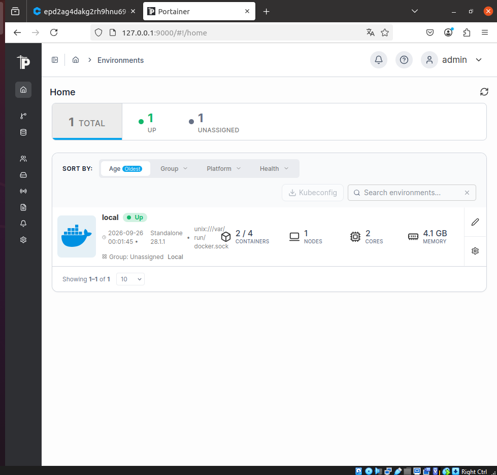

### Деплой стека с nginx из локального registry через Web editor

Создан новый стек `nginx-stack` в разделе Stacks:

```yaml
version: '3'

services:
  nginx:
    image: 127.0.0.1:5000/custom-nginx
    ports:
      - "9090:80"
```

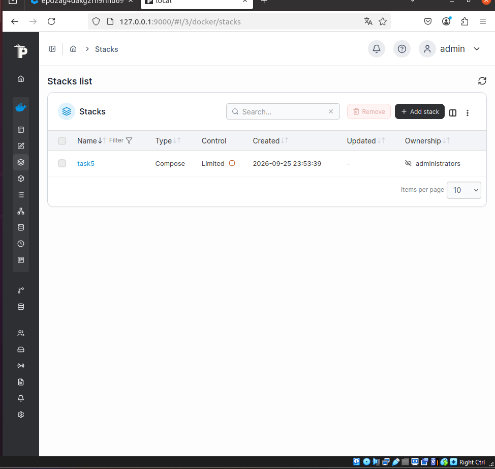

Стек успешно задеплоен, контейнер `nginx-stack-nginx-1` запущен (статус running), использует образ `127.0.0.1:5000/custom-nginx` из локального Docker Registry.

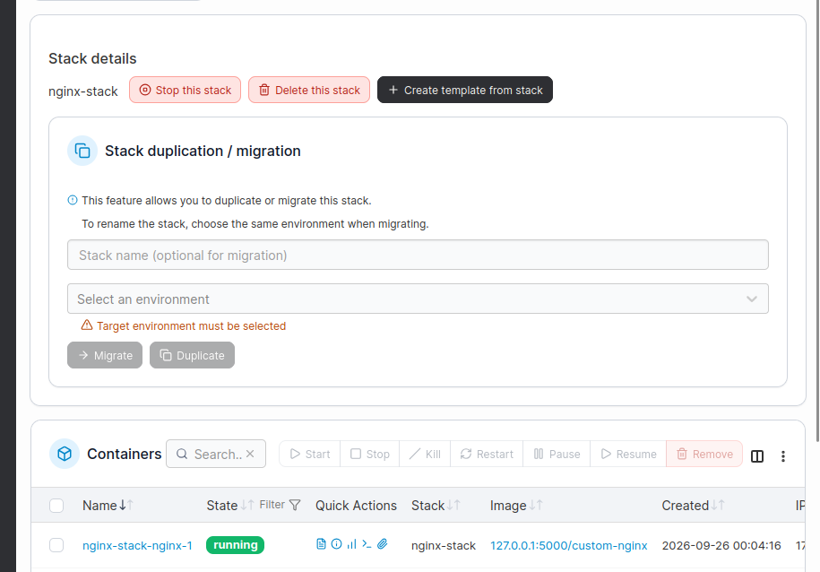

Проверка в браузере — `http://127.0.0.1:9090` отдаёт кастомную страницу:

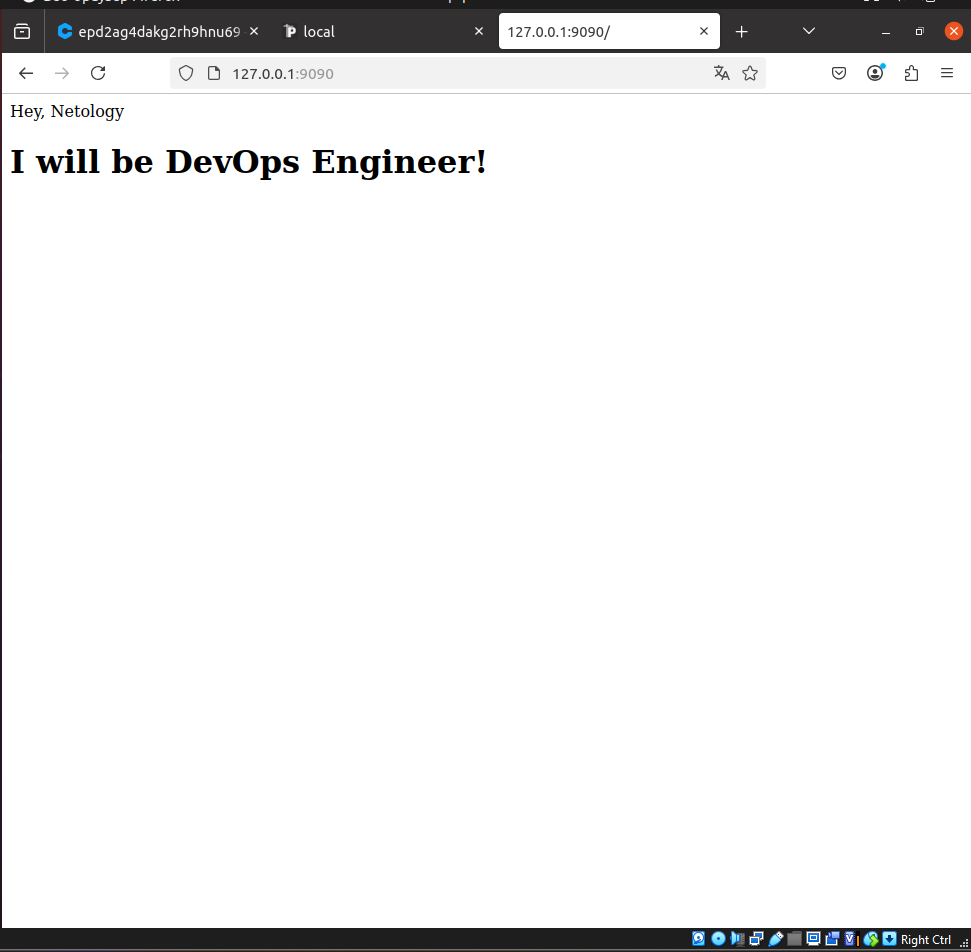

### Inspect контейнера через Portainer (режим Tree)

Открыт раздел Inspect контейнера `nginx-stack-nginx-1` в режиме `<> Tree`. Развёрнуто поле `Config`, сделан скриншот от поля `AppArmorProfile` до поля `Driver`.

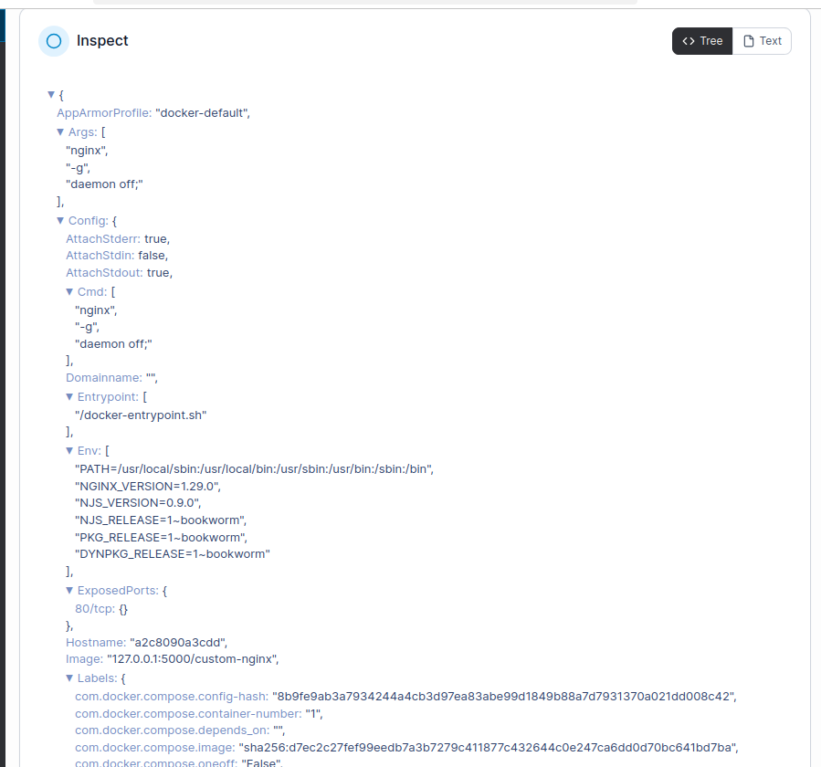
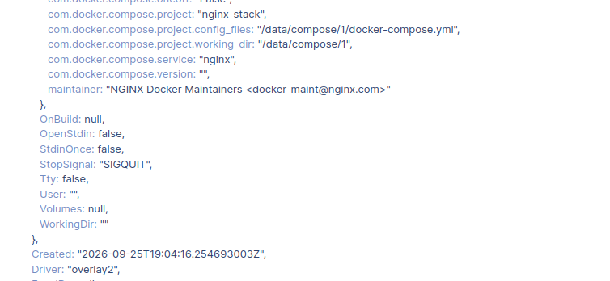

Ключевые поля из Config:
- `AppArmorProfile: "docker-default"`
- `Image: "127.0.0.1:5000/custom-nginx"`
- `com.docker.compose.project: "nginx-stack"`
- `com.docker.compose.project.config_files: "/data/compose/1/docker-compose.yml"`
- `maintainer: "NGINX Docker Maintainers <docker-maint@nginx.com>"`
- `Created: "2026-09-25T19:04:16.254693003Z"`
- `Driver: "overlay2"`

### Удаление одного из манифестов, warning об orphan-контейнерах

```bash
$ cd /tmp/netology/docker/task5
$ ls
compose.yaml  docker-compose.yaml

$ rm compose.yaml
$ ls
docker-compose.yaml

$ docker compose up -d
WARN[0000] /tmp/netology/docker/task5/docker-compose.yaml: the attribute `version` is obsolete, it will be ignored, please remove it to avoid potential confusion
WARN[0000] Found orphan containers ([task5-portainer-1]) for this project. If you removed or renamed this service in your compose file, you can run this command with the --remove-orphans flag to clean it up.
[+] Running 1/1
 ✔ Container task5-registry-1  Running
```


**Суть предупреждения:**

Поскольку файл `compose.yaml` был удалён, Docker Compose нашёл только оставшийся `docker-compose.yaml`, в котором описан только сервис `registry` — сервиса `portainer` там больше нет (он был описан только в удалённом `compose.yaml`).

При выполнении `docker compose up -d` Docker Compose сравнивает состав сервисов в текущем файле с уже запущенными контейнерами этого же проекта (проект определяется по имени директории — `task5`). Контейнер `task5-portainer-1` всё ещё физически существует и запущен, но в новом (единственном оставшемся) файле конфигурации для него больше нет соответствующего описания сервиса. Такой контейнер Docker Compose называет **«orphan»** (осиротевший) — он принадлежит проекту, но не описан ни в одном из применяемых сейчас compose-файлов. Docker Compose не удаляет такие контейнеры автоматически — только предупреждает об их существовании и подсказывает, как их убрать (через флаг `--remove-orphans`), чтобы не потерять данные по ошибке.

### Выполнение предложенного действия и остановка проекта одной командой

```bash
$ docker compose up -d --remove-orphans
WARN[0000] ...the attribute `version` is obsolete...
[+] Running 2/2
 ✔ Container task5-portainer-1  Removed
 ✔ Container task5-registry-1   Running

$ docker compose down
[+] Running 2/2
 ✔ Container task5-registry-1  Removed
 ✔ Network task5_default       Removed
```

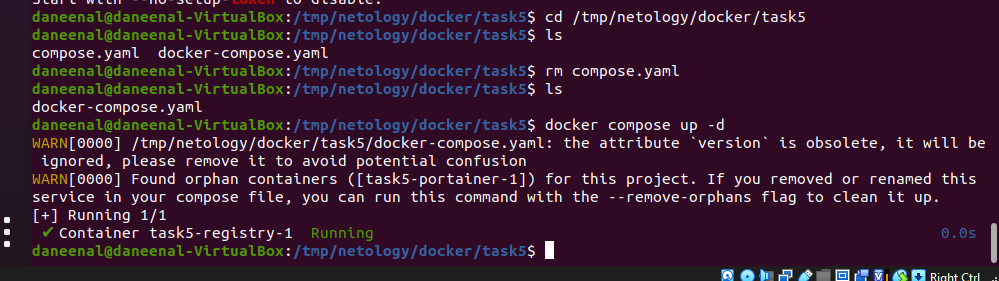
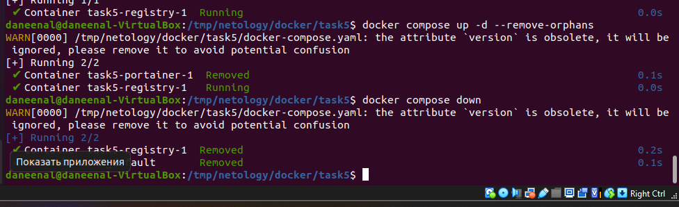

Флаг `--remove-orphans` удалил лишний контейнер `task5-portainer-1`, оставив только актуальный по текущему compose-файлу `task5-registry-1`. Команда `docker compose down` полностью остановила и удалила весь проект (контейнер и сеть) одной командой.

---

## Итог

Все обязательные пункты заданий 1–5 выполнены и задокументированы выше вместе со скриншотами консоли/браузера. Дополнительное (необязательное) задание в Задаче 3 про самостоятельное исправление конфигурации порта — пропущено.
