# ДЗ 6. Оркестрация кластером Docker контейнеров на примере Docker Swarm

Самостоятельная работа, без проверки преподавателем.

## Задача 1. Кластер Docker Swarm из 3 VM

**Задание:** поднять в Яндекс.Облаке 3 VM, поставить Docker, собрать Swarm-кластер (1 менеджер + 2 воркера).

**Решение:** сеть/подсеть, 3 VM (`swarm-master`, `swarm-worker-1`, `swarm-worker-2`), Docker (пришлось ставить из репозитория Ubuntu вместо `download.docker.com` — тот блокируется с IP облака), `docker swarm init` на мастере, `docker swarm join` на воркерах.

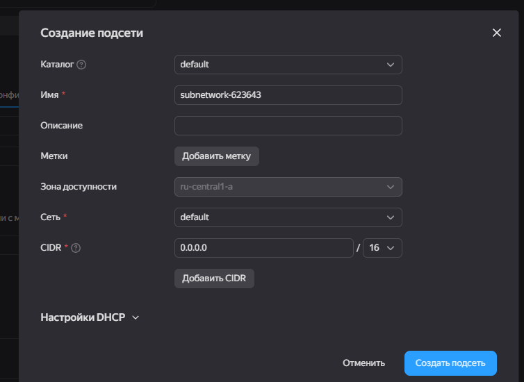
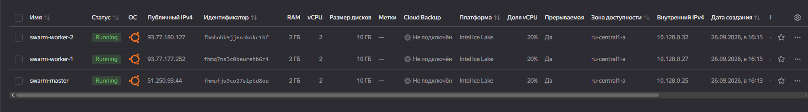
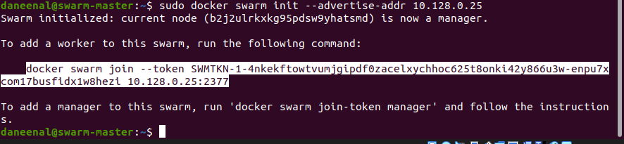
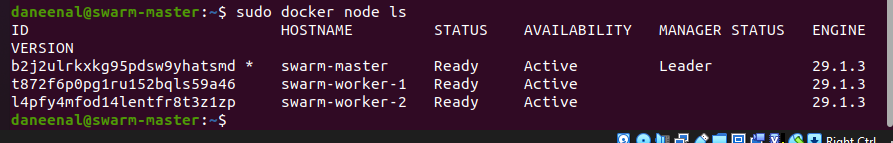

## Задача 2. Деплой приложения из ДЗ3 в кластер

**Задание:** развернуть в собранном кластере приложение из ДЗ3 (форк FastAPI+MySQL), проверить работу, удалить инфраструктуру.

**Решение:** собрал образ из `Dockerfile.python` (тот же, что в ДЗ3), запушил в Container Registry, задеплоил через `docker stack deploy`. Проверил `curl`-ом — и локально, и через routing mesh с внешнего IP другой ноды. После проверки кластер и все ресурсы удалены.

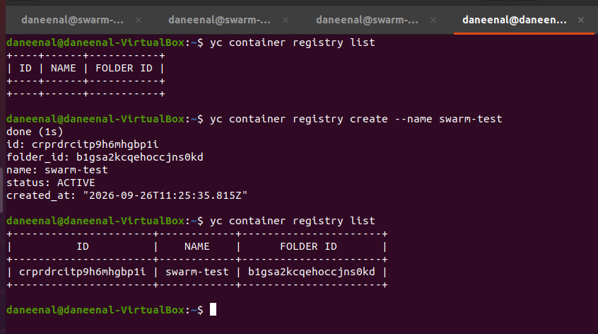
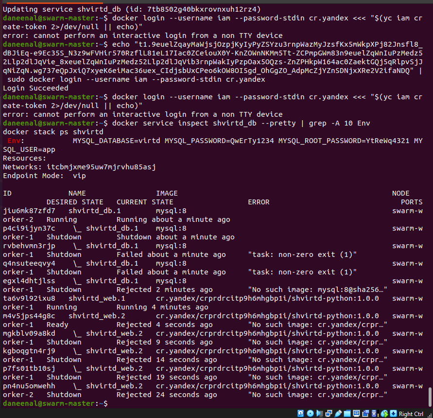
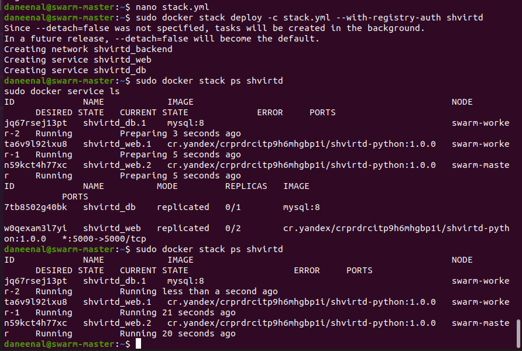
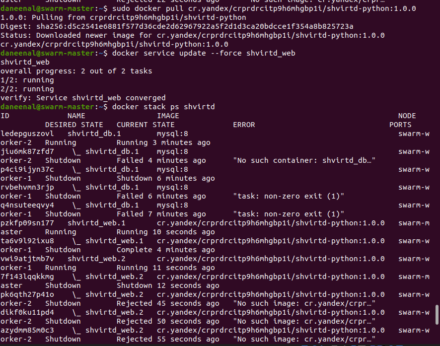

## Задача 3. Terraform + Ansible + мониторинг

**Задание:** повторить архитектуру из лекции — поднять кластер Swarm (6 VM: активный менеджер, 2 резервных менеджера, 3 воркера) через Terraform, который сам запускает Ansible с динамическим inventory, и задеплоить стек мониторинга (Prometheus/Grafana). Проверить доступность Grafana.

**Решение:**

- Terraform создаёт сеть, подсеть и 6 VM в Яндекс.Облаке
- `inventory.tf` генерирует inventory для Ansible из реальных внешних IP созданных VM (`local_file`)
- `ansible.tf` запускает по цепочке прямо из `terraform apply`: установку Docker и инициализацию Swarm → синхронизацию конфигов мониторинга на все ноды → `docker stack deploy` стека `swarmprom` (Prometheus, Grafana, Alertmanager, cAdvisor, node-exporter, Caddy) только на активном менеджере

Что пришлось поправить по ходу:
- `download.docker.com` заблокирован с IP Яндекс.Облака — поставил Docker из репозитория Ubuntu (`docker.io` + `docker-compose-v2`)
- гонка с `unattended-upgrades` при установке пакетов — добавил retry в Ansible-роль
- `docker swarm init`/`join` не идемпотентны — добавил обработку "already part of a swarm" как не-ошибки, чтобы повторный `terraform apply` не ломал уже готовый кластер
- `google/cadvisor:latest` не совместим с cgroup v2 в Ubuntu 22.04 (`mountpoint for cpu not found`) — заменил на `gcr.io/cadvisor/cadvisor:v0.47.2`

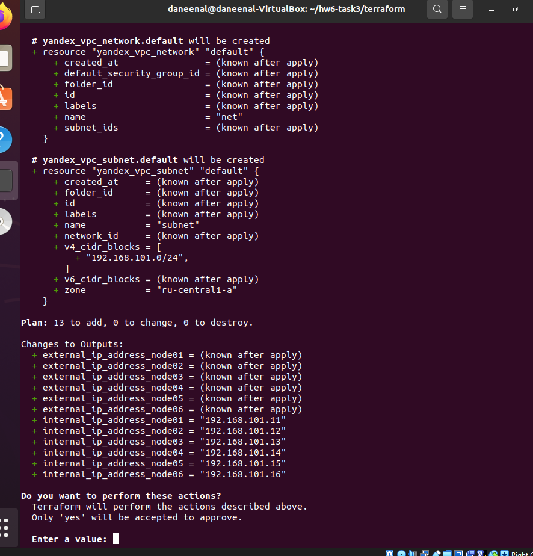
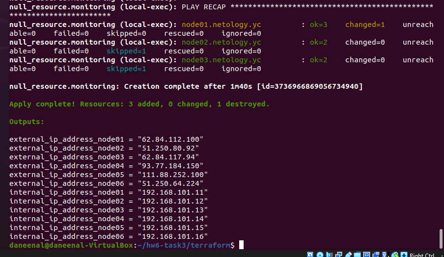
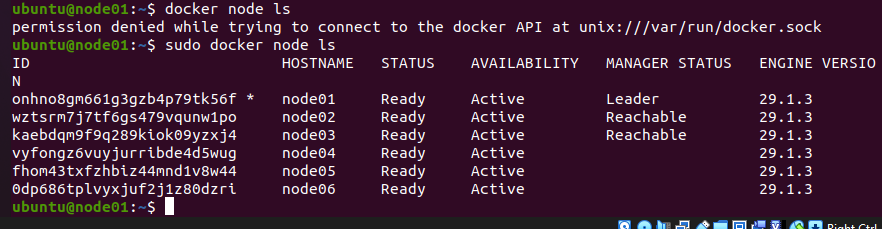
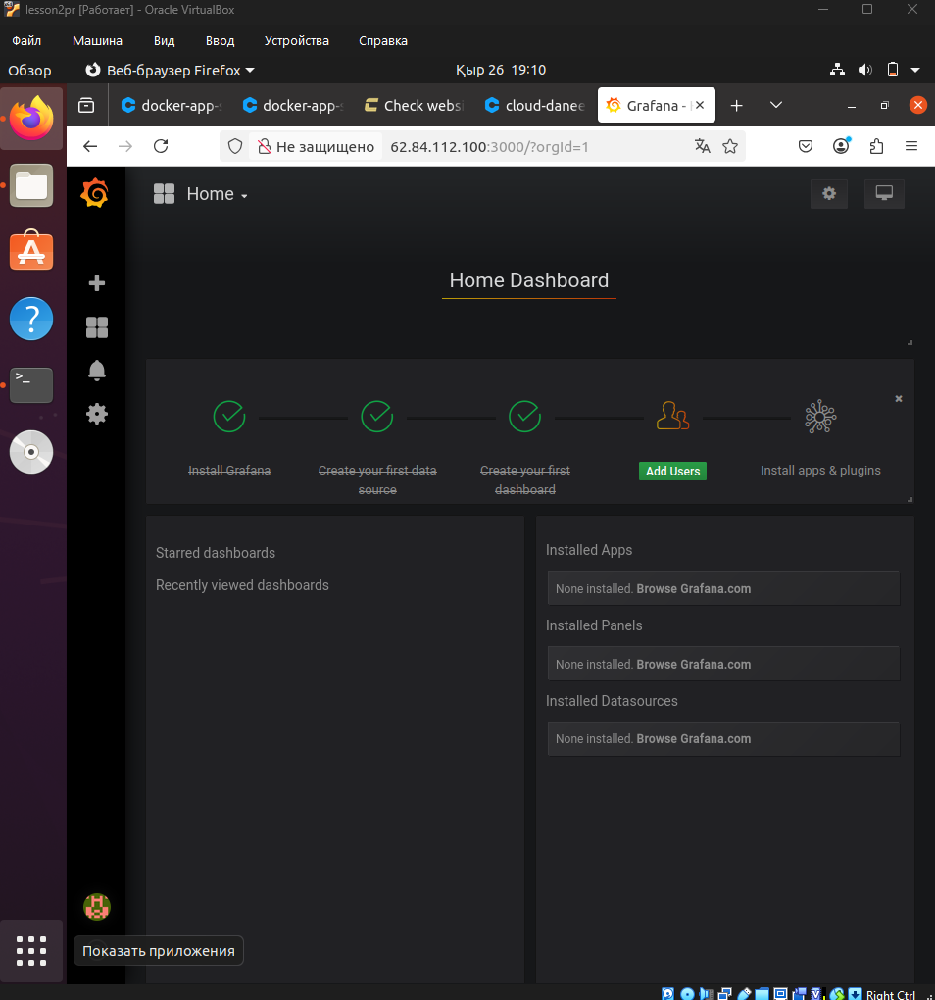

После проверки вся инфраструктура снесена через `terraform destroy`.
